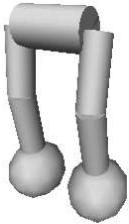

# Title

Abandoning Objective Abandoning Objectives: Evolution Through Through the Search for Novelty Alone

Joel Lehman
University of Central Florida
Kenneth O. Stanley
University of Central Florida

Colin Milhaupt & Greg Jacobus
University of New Mexico

# Introduction

* Discusses algorithms used for evolutionary computation (EC).
* Previous approaches primarily used objective functions.
    * Example: Chinese finger trap
    * Problem: Only finds local optima (deception)
* New Idea: Search for novelty instead.
    * Completely ignores the objective
* How can we use these approaches to model evolution?
* Main idea: The objective function isn't as perfect as we used to think, sometimes novelty functions work better.

{width=35%}

# Background

* Deception -- when lower-order building blocks are combined and don't lead to a global optimum.
    * Multi-Objective Evolutionary Algorithms can sometimes fight deception by training against multiple objectives.
    * Incremental evolution of objective functions can also help
        * Implies the need to track the "stepping stones" that lead to the objective
* Selection pressure restricts the scope and direction of search
* NeuroEvolution of Augmenting Topologies (NEAT)
    * Evolves artificial neural networks
    * Complexifies the network over generations

# The Search for Novelty

* Learning method is rewarded finding instances that are significantly different from any found before
* Biped locomotion example:
    * Novelty function would reward falling in new ways (maybe eventually walking)
    * Objective function function would reward falling the furthest
* Novelty search is different from exhaustive search
    * Domain typically limits the variety of behaviors
    * Since NEAT starts simple and complexifies, it is much better than random.

# Novelty Search Algorithm

* Replace objective function with novelty function in NEAT
* Characterize how far new result is from all previous results
    * Average distance to *k*-nearest neighbors
* Still needs to check distance to objective to know when to stop

# Experiment 1: Maze
$$
\includegraphics[width=200px]{"images/maze.png"}
$$

- Great for deception problems because dead ends that lead close to the goal are local optima
- Fitness-based NEAT metric is defined as the distance from the robot to the goal at the end of an evaluation
- Novelty-based NEAT metric rewards the robot for ending in a place where none have ended before; the method of traversal is ignored

# Experiment 1: Maze Results
$$
\includegraphics[width=200px]{"images/maze_performance.png"}
$$

- Fitness-based NEAT was three times slower (56k evaluations vs 18k)
- The average genomic complexity of solutions evolved by fitness-based NEAT was almost three times greater  than those evolved by Novelty-based NEAT
- The hard map was solved 3/40 times by fitness-based NEAT and 39/40 times by novelty-based NEAT

# Experiment 1: Maze Behaviors
$$
\includegraphics[width=150px]{"images/maze_with_walls_comparison.png"}
$$

- Bounding the Size of the Archive in the Maze Domain
    + Possible to limit the archive size, and thus additional computational effort, without significantly decreasing the performance of novelty search
- Removing Walls in the Maze Domain
    + Fitness fares no better; fitness-based search is not necessarily a viable alternative even when novelty search is not effective

# Experiment 1: Maze Behaviors

- Lengthening the Behavioral Characterization
    + High-dimensional behavior characterization is not a sufficient basis for predicting that novelty search should fail
- Reducing the Precision of the Behavioral Characterization
    + Archive size can be limited without significant loss of performance
- Characterizing Behavior as the Fitness Measure
    + This type of conflation can be disruptive to novelty search

# Biped Experiment

* A more challenging problem than the Maze Problem
* Robot needs to walk as far as possible in given time
    * 6 DOF -- pitch and roll in each hip, pitch in knee
* Novelty metric: each second, sample the offset of the center of mass
* Average distance traveled for:
    * Objective Function: 2.88 meters
    * Novelty Function: 4.04 meters
* The novelty function produced models that were significantly less complex
* [Video](https://www.youtube.com/watch?v=lyZorMEvmjM)

{width=10%}

# Discussion/Conclusion

- Objective Limitations
- Domain-Independent Open-Endedness
- Novelty Search and Natural Evolution
- The Arrow of Complexity
- Further Results on Novelty Search

\begin{center}
Novelty search suggests a surprising new perspective on achievement: To achieve your highest goals, you must be willing to abandon them
\end{center}
